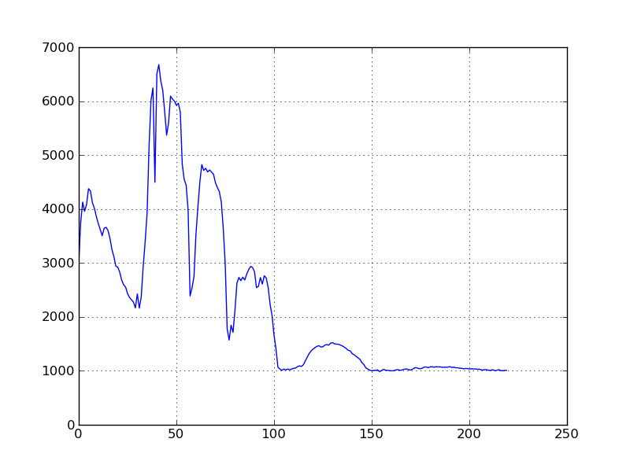
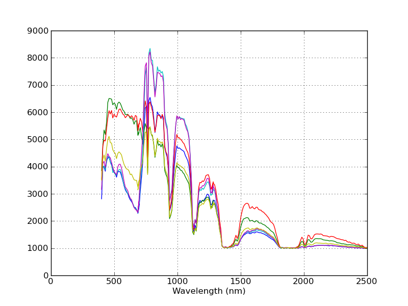
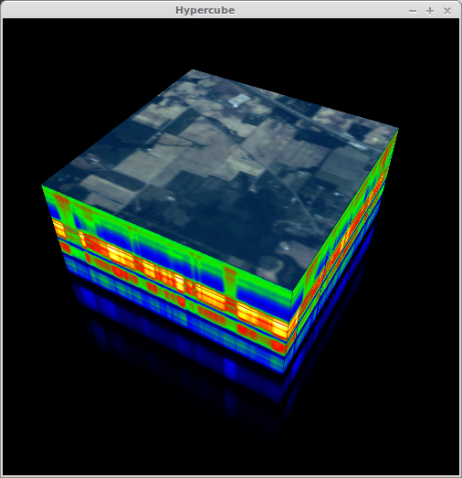
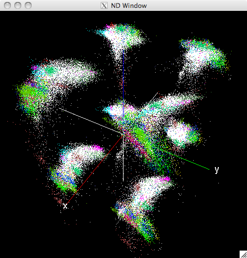
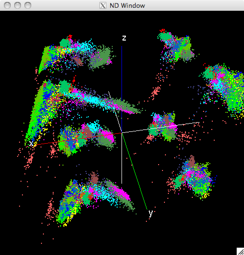

.. toctree::
    :maxdepth: 2

.. _graphics:

===============
Displaying Data
===============

.. ipython::
    :suppress:

    In [9]: import matplotlib

    In [9]: import matplotlib.pyplot as plt

    In [9]: matplotlib.use('Agg')

.. _starting_ipython:

Starting IPython
================

SPy uses IPython to provide GUI windows without blocking the interactive python
interpreter.  To enable this, you must start IPython in "pylab" mode.  If you
have already set your `matplotlib backend <http://matplotlib.org/faq/usage_faq.html#what-is-a-backend>`_
to either "WX" or "WXAgg" in your matplotlibrc file, you should be able to
start IPython for SPy like this::

    ipython --pylab
    
You can also set the backend explicitly when starting IPython this way::

    ipython --pylab=wx
    
.. note::

    If you are not calling GUI functions (calling :func:`~spectral.save_rgb`
    doesn't count as a GUI function), then it is not necessary to run IPython -
    you can run the standard python interpreter.

.. note::

    If you are not able to run the `WX` backend on your system, you can still use
    a different backend (e.g., `Qt4Agg` or `TkAgg`); however you will be unable
    to call the :func:`~spectral.view_cube` or
    :func:`~spectral.view_nd` functions.

Raster Displays
===============

Displaying images with `imshow`
*******************************

The SPy :func:`~spectral.graphics.spypylab.imshow` function is a wrapper around
the matplotlib function of the same name. The main differences are that the SPy
version makes it easy to display bands from multispectral/hyperspectral images,
it renders classification images, and supports several additional types of
interactivity.

Image Data Display
~~~~~~~~~~~~~~~~~~

To display the RGB bands as shown for the `view` function above, pass the same
arguments to `imshow`:

.. ipython::

    In [1]: from spectral import *
    
    In [1]: img = open_image('92AV3C.lan')
    
    @savefig imshow_92AV3C_rgb.png scale=33% align=center
    In [1]: view = imshow(img, (29, 19, 9))

When displaying the image interactively, the matplotlib button controls can be
used to pan and zoom the displayed images. If you press the "z" keyboard key,
a zoom window will be opened, which displays a magnified view of the image. By
holding down the **CONTROL** key and left-clicking in the original window, the
zoom window will pan to the pixel clicked in the original window.

Class Map Display
~~~~~~~~~~~~~~~~~

To display the ground truth image using :func:`imshow`, set the *classes*
argument in the `imshow` function:

.. ipython::

    In [1]: gt = open_image('92AV3GT.GIS').read_band(0)
    
    @savefig imshow_92AV3C_gt.png scale=33% align=center
    In [9]: view = imshow(classes=gt)
It is also possible to switch between displaying image bands and class colors,
as well as displaying class color masks overlayed on the image data display. To
do this, specify both the data and class values when calling :func:`imshow`:

.. ipython::

    @verbatim
    In [9]: view = imshow(img, (30, 20, 10), classes=gt)

The default display mode is to show the image bands. Press "d", "c",
or "C" (while focus is on the image window) to switch the display to *data*,
*classes*, or *class overlay*, respectively. Setting the display parameters can also
be done programatically. For example, to display the image with overlayed class
masks, using an alpha transparency of 0.5, type the following commands after
calling :func:`imshow`:

.. ipython::

    In [9]: view = imshow(img, (30, 20, 10), classes=gt)

    In [9]: view.set_display_mode('overlay')

    In [9]: view.class_alpha = 0.5

    @suppress
    In [9]: plt.savefig('images/imshow_92AV3C_overlay.png')

.. figure:: images/imshow_92AV3C_overlay.png
   :align:  center
   :scale:  30 %

Interactive Class Labeling
~~~~~~~~~~~~~~~~~~~~~~~~~~

The :class:`ImageView` window provides the ability to modify pixel class IDs interactively
by selecting rectangular regions in the image and assigning a new class ID.
Applying a class ID to a rectangular region is done using the following steps:

    #. Call :func:`imshow`, providing an initial array for the *classes* argument.
       This must be a non-negative, integer-valued array. A class ID value of zero
       represents an unlabeled pixel so to start with a completely unlabeled
       image, pass an array of all zeros for the *classes* argument.

    #. While holding the **SHIFT** key, click with the left mouse button at the
       upper left corner of the rectangle to be selected. Drag the mouse cursor
       and release the mouse button at the lower right corner of the rectangular
       region. Note that releasing the **SHIFT** key before the mouse button is
       released will result in cancellation of the selection operation.

    #. With focus still on the :class:`ImageView` window, enter the numeric
       class ID to apply to the region. The class ID can contain multiple digits.
       The digits will not be echoed on the command line. Press **ENTER** to
       apply the class ID. The command line will request confirmation of the
       opertion. Press **ENTER** again to apply the class ID or press any other
       key to cancel the operation.

Classes can be assigned form either a main :class:`ImageView` window or from
an associated zoom window. While the selection tool only produces rectangular
regions, you can assign classes to non-rectangular regions by first assigning
the class ID to a super-rectangle covering all the pixels of interest, then
reassigning sub-rectangles back to class 0 (or whatever was the original class ID).

Additional Capabilities
~~~~~~~~~~~~~~~~~~~~~~~

To get help on :class:`ImageView` keyboard & mouse functions, press "h" while focus is on
the image window to display all keybinds and mouse functions::

    Mouse Functions:
    ----------------
    ctrl+left-click          ->   pan zoom window to pixel
    shift+left-click&drag    ->   select rectangular image region
    left-dblclick            ->   plot pixel spectrum

    Keybinds:
    ---------
    0-9     -> enter class ID for image pixel labeling
    ENTER   -> apply specified class ID to selected rectangular region
    a/A     -> decrease/increase class overlay alpha value
    c       -> set display mode to "classes" (if classes set)
    C       -> set display mode to "overlay" (if data and classes set)
    d       -> set display mode to "data" (if data set)
    h       -> print help message
    i       -> toggle pixel interpolation between "nearest" and SPy default.
    z       -> open zoom window

    See matplotlib imshow documentation for addition key binds.

To customize behavior of the image display beyond what is provided by the
:func:`~spectral.graphics.spypylab.imshow` function, you can create an
:class:`~spectral.graphics.spypylab.ImageView` object directly and customize it
prior to calling its :meth:`show` method. You can also access the
matplotlib :attr:`figure` and :attr:`canvas` attributes from the :attr:`axes`
attribute of the :class:`ImageView` object returned by :func:`imshow`. Finally,
you can customize some of the default behaviours of the image display by
modifiying members of the module's :class:`~spectral.spectral.SpySettings`
object.

Displaying images with `view` and `view_indexed`
************************************************

.. note::

    :func:`spectral.view` and :func:`spectral.view_indexed` functions are
    older raster display functions, which are superceded by the SPy
    :func:`~spectral.graphics.spypylab.imshow` function (which is a wrapper
    around matplotlib's `imshow` function). The `view*` functions always display
    images at full resolution (one image pixel corresponds to one screen pixel),
    which is convenient for small chips (such as those used in this documentation).
    However, for typical image dimensions, it is more convenient to use the
    `imshow` function, which provides capabilities such as panning, zooming,
    resizing, class map overlays, and pixel class labeling. The `view*`
    functions will likely be deprecated and subsequently removed in future
    versions of the software.

The :func:`~spectral.view` function opens a window that displays a raster view of
an image.

.. ipython::

    @suppress
    In [1]: import wx
    
    @suppress
    In [2]: app = wx.App()

    @verbatim    
    In [5]: w = view(img)
    
    @suppress
    In [6]: save_rgb('images/view_image_default.jpg', img)

.. figure::	images/view_image_default.jpg
   :align:	center
   
   Displaying first, middle, and last bands as RGB

The image file did not contain metadata on which bands to display so :func:`~spectral.view`
took the first, middle and last band from the image file and displayed those bands
as the red, green, and blue channels, resulting in an unsatisfying view of the
image.  To display an image closer to a natural color view of the image, we would like to
display the bands closest to the red, green, and blue wavelengths.  For our example
image, those correspond roughly to the 30th, 20th, and 10th bands of the image.
We can display these bands through the :func:`~spectral.view` function in two ways.
First, we can explicitly pass the band indices as arguments.

.. ipython:: python

    @verbatim
    In [1]: w = view(img, [29, 19, 9])
    
    @suppress
    In [2]: save_rgb('images/view_image_rgb.jpg', img, [29, 19, 9])

Alternately, we can specify the default bands to display for the image by setting
the ``default bands`` metadata field in the image before calling the :func:`~spectral.view`.

.. ipython:: python

    In [3]: img.metadata['default bands'] = [29, 19, 9]
    
    @verbatim
    In [4]: w = view(img)

For either method, the resulting image will appear as follows.

.. figure::	images/view_image_rgb.jpg
   :align:	center
   
   Color view of the image

The ``bands`` argument of :func:`~spectral.view` expects a list of either one or
three integers so we can display the green band from the image in greyscale like this:

.. ipython:: python

    @verbatim
    In [5]: w = view(img, [19])

.. figure::	images/view_image_g.jpg
   :align:	center
   
   Green band in greyscale

The :func:`~spectral.view` function also works with ``numpy`` arrays, so the
previous two image displays can alternately be created as follows.

.. ipython::

    In [6]: rgb = img.read_bands([29, 19, 9])
    
    @verbatim
    In [7]: w = view(rgb)
    
    In [8]: green = img[:,:,19]
    
    @verbatim
    In [9]: w = view(green)
    
    @suppress
    In [10]: save_rgb('images/view_image_g.jpg', img, [19])

To save an image display to disk, use the :func:`~spectral.save_rgb` function,
which uses the same arguments as :func:`~spectral.view` but with the saved image
file name as the first argument.

.. ipython::

    @verbatim
    In [11]: save_rgb('rgb.jpg', img, [29, 19, 9])

While the :func:`~spectral.view` function displays color images by specifying
RGB triplets for each pixel, the :func:`~spectral.view_indexed` function creates
color images via integer-valued arrays that represent indices into a color palette.
This type of display is useful for generating images for ground truth masks or
classification results.  For example, we can display the ground truth file for
our sample image like this:

.. ipython::

    In [12]: gt = open_image('92AV3GT.GIS').read_band(0)
    
    @verbatim
    In [13]: w = view_indexed(gt)

.. figure::	images/view_gt.jpg
   :align:	center
   
   Ground truth mask for the sample image

The colors used by default are those defined in **spectral.spy_colors**, which
is a list of 3-tuples, where each 3-tuple is a triplet defining an RGB color (R,
G, and B are each in the range [0-255]).  The colors used by :func:`~spectral.view_indexed`
can be changed by passing an alternate set of colors in the ``colors`` keyword
argument:

.. ipython::

    @verbatim
    In [11]: w = view_indexed(gt, colors=myColors)

Saving an indexed color image is similar to saving an RGB image; however, :func:`~spectral.save_rgb`
is unable to determine if the image being saved is a single-band (greyscale) image
or an indexed color image.  Therefore, to save as an indexed color image, the color
palette must be explicitly passed as a keyword argument:

.. ipython::

    @verbatim
    In [12]: save_rgb('gt.jpg', gt, colors=spy_colors)
    
    @suppress
    In [13]: save_rgb('images/view_gt.jpg', gt, colors=spy_colors)

Spectrum Plots
==============

The image display windows provide a few interactive functions.  If you create an
image display with :func:`~spectral.graphics.spypylab.imshow` (or :func:`~spectral.view`)
and then double-click on a particular location in the window, a new window will
be created with a 2D plot of the spectrum for the pixel that was clicked. It
should look something like this:

Note that the row/col of the double-clicked pixel is printed on the command prompt.
Since there is no spectral band metadata in our sample image file, the spectral
plot's axes are unlabeled and the pixel band values are plotted vs. band number,
rather than wavelength.  To have the data plotted vs. wavelength, we must first
associated spectral band information with the image.

.. ipython::

    In [12]: import spectral.io.aviris as aviris
    
    In [13]: img.bands = aviris.read_aviris_bands('92AV3C.spc')

Now, close the image and spectral plot windows, call :func:`~spectral.view`
again and click on a few locations in the image display.  You will notice that
the x-axis now shows the wavelengths associated with each band.

Notice that the spectra are now plotted against their associated wavelengths.

The spectral plots are intended as a convenience to enable one to quickly view
spectra from an image.  If you would like a prettier plot of the same data, you
can use SPy to read the spectra from the image and create a customized plot by
using `matplotlib <http://matplotlib.org/>`_ directly.

Hypercube Display
=================

In the context of hyperspectral imagery, a 3D hypercube is a 3-dimensional
representation of a hyperspectral image where the *x* and *y* dimensions are the spatial
dimensions of the image and the third dimension is the spectral dimension.  The
analytical utility of hypercube displays is debatable but what is not debatable
is that they look extremely cool.

After calling :func:`~spectral.view_cube`,
a new window will open with the 3D hypercube displayed.  After shifting
command focus to the newly created window, you can use keyboard input to alter
the view of the hypercube.  Using keyword arguments, you can change the image
displayed on the top of the cube, as well as the color scale used on the sides of
of the cube.

.. ipython::

    @verbatim
    In [16]: view_cube(img, bands=[29, 19, 9])

.. code::

    Mouse Functions:
    ----------------
    left-click & drag        ->   Rotate cube
    CTRL+left-click & drag   ->   Zoom in/out
    SHIFT+left-click & drag  ->  Pan
    
    Keybinds:
    ---------
    l       -> toggle light
    t/g     -> stretch/compress z-dimension
    h       -> print help message
    q       -> close window

.. note::

    If the window opened by :func:`~spectral.view_cube` produces a blank canvas
    (no cube is displayed), it may be due to your display adapter not supporting
    a 32-bit depth buffer.  You can reduce the size of the depth buffer used by
    :func:`~spectral.view_cube` and :func:`~spectral.view_nd` to a smaller value
    (e.g., 16) by issuing the following commands:

    .. ipython::
	:verbatim:
	
	In [16]: import spectral
	
	In [16]: spectral.settings.WX_GL_DEPTH_SIZE = 16
    
.. _nd_displays:

N-Dimensional Feature Display
=============================

Since hyperspectral images contain hundreds of narrow, contiguous bands, there is often
strong correlation between bands (particularly adjacent bands).  To increase the
amount of information displayed, it is common to reduce the dimensionality of
the image to a smaller set of features with higher information density (e.g., by
principal components transformation).  Nevertheless, there are typically still
many more than three features remaining in the transformed image so the analyst
must decide which are the "best" three features to display to highlight some
aspect of the data set (e.g., separability of the spectral classes).  It is
desirable to be able to quickly switch displayed features to examine many
combinations of features in a short time span.

In most cases, the display will be more useful by first performing
dimensionality reduction prior to viewint the data (e.g., by selecting some
number of principal components).

.. ipython::
    :verbatim:
    
    In [17]: data = open_image('92AV3C.lan').load()
    
    In [18]: gt = open_image('92AV3GT.GIS').read_band(0)
    
    In [19]: pc = principal_components(data)
    Covariance.....done  
    
    In [20]: xdata = pc.transform(data)
    
    In [21]: w = view_nd(xdata[:,:,:15], classes=gt)

A new window should open and appear as follows:

   
   Initial view of the N-Dimensinal window

The python prompt will display the set of keyboard and mouse commands accepted
by the ND window::

    Mouse functions:
    ---------------
    Left-click & drag       -->     Rotate viewing geometry (or pan)
    CTRL+Left-click & drag  -->     Zoom viewing geometry
    CTRL+SHIFT+Left-click   -->     Print image row/col and class of selected pixel
    SHIFT+Left-click & drag -->     Define selection box in the window
    Right-click             -->     Open GLUT menu for pixel reassignment

    Keyboard functions:
    -------------------
    a       -->     Toggle axis display
    c       -->     View dynamic raster image of class values
    d       -->     Cycle display mode between single-quadrant, mirrored octants,
		    and independent octants (display will not change until features
		    are randomzed again)
    f       -->     Randomize features displayed
    h       -->     Print this help message
    m       -->     Toggle mouse function between rotate/zoom and pan modes
    p/P     -->     Increase/Decrease the size of displayed points
    q       -->     Exit the application
    r       -->     Reset viewing geometry
    u       -->     Toggle display of unassigned points (points with class == 0)

The following figure shows the same window after the display has been rotated,
unlabeled pixels (white) have been supressed, and the displayed pixel size has
been increased:

   
   Modified view of the N-Dimensinal window

Display Modes
*************

To facilitate interactive visual analysis of high-dimensional images, the
:func:`~spectral.view_nd` function provides several modes for
displaying high-dimensional data in a 3-dimensional display window:

#. Single-Octant Mode - In this mode, three features from the image are selected
   and mapped to the x, y, and z axes in the
   3D window.  The data are translated and scaled such that the displayed points
   fill the positive x/y/z octant of the 3D space.  The user can choose to
   randomly select a new set of three features to display.  With this randomization
   capability, the user can rapidly cycle through various combinations of features
   to identify desirable projections.

#. Mirrored-Octant Mode - In this mode, three features are mapped to the
   positive x, y, and z axes as in the single-octant mode.  However, an
   additional three features are selected and mapped the the negative portions
   of the x, y, and z axes.  The image pixels are then displayed in each of the eight
   octants of the 3D display, using whichever features are associated with the
   three semi-axes for the particular octant.  In this mode, each partial plane
   defined by two semi-axes can be considered a mirror, with the two
   perpendicular semi-axes representing different features.  For example, if the
   x, y, z, -x, -y, and -z semi-axes are associated with features 1 through 6,
   respectively, then the data points in the x/y/z and x/y/-z quadrants will
   have a common projection onto the x/y plane.  However, since z and -z are
   mapped to different features, the data points will have different projections
   along the z and -z axes.  As with the single-octant mode, the user can
   randomize the 6 features displayed.

#. Independent-Octant Mode - In this mode, each octant of the 3D space represents
   3 independent features, enabling up to 24 features to be displayed.  As with
   the other two modes, the data points are translated and scaled such that the
   entire set of image pixels completely fills each octant.  It is possible that
   a particular feature may be used in more than one octant.

The user has the option of switching between display modes.  Which display mode
is best may depend on a number of factors relating to the data set used or the
system on which the application is run.  For images with sufficiently large
numbers of pixels, the system's display refresh rate may begin to suffer in
mirrored-octant or independent-octant mode because each image pixel must be
rendered 8 times.  When performance is not an issue, the latter two modes provide
more simultaneous projections of the data that may enable a user to more quickly
explore the data set.

User Interaction
****************

The initial 3D view of the rendered image data will almost certainly not be the
ideal 3D viewing geometry; therefore, the window allows the user to
manipulate the view by using the mouse input to zoom, pan, and rotate
the viewing geometry.  The user can also increase/decrease the size of displayed
image pixels and toggle display of unlabeled (class 0) pixels.

While pixel color allows the user to distinguish between classes of displayed
pixels, it may not be obvious to which class a given color is associated. To
identify the class of a specific pixel, the user can click on a pixel and the
python command line will print the pixel's location within the image
(row and column values) and the number (ID) of the class of the pixel.  Since
clicking on a single screen pixel is difficult, the user can first increase the
size of the displayed image pixels such that the image pixel can easily be
selected with the mouse.

Data Manipulation
*****************

It is common for an analyst to want to review the results of unsupervised
classification and subsequently combine pixel classes or reassign pixels to new
or different classes.  Similarly, an analyst may want to assess ground truth data and
possibly reassign pixels that were erroneously included in a class when the
ground truth image was developed.  To support this capability, the N-D window
allows the user to click and drag with the mouse to select a rectangular region
and then reassign all pixels lying within the defined box.  The application will
not only reassign the pixels visible within the selection box but also all pixels
within the projection of the box through the 3D space.

When :func:`~spectral.view_nd` is called, it returns a proxy
object that has a `classes` member that represents the current array of class
values associated with the ND display.  The proxy object can be used to access
the updated class array after image pixels have been reassigned through the ND
window.  The proxy object also has a :meth:`set_features` method to specify the
set of features displayed in the 3D window.

.. tip::

   Before reassigning pixel class values, press the "c" key to open a second
   window displaying a raster view of the current image pixel class values. Then, when
   you reassign pixel classes in the ND window, the class raster view will
   update automatically, providing and indication of which pixels in the source
   image were modified.
