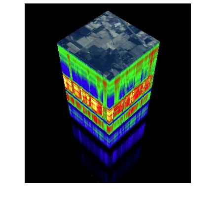

.. Spectral Python documentation master file, created by
   sphinx-quickstart on Sun Jul 11 16:15:08 2010.
   You can adapt this file completely to your liking, but it should at least
   contain the root `toctree` directive.

.. _home:

Welcome to Spectral Python (SPy)
--------------------------------

Spectral Python (SPy) is a pure Python module for processing hyperspectral image
data. It has functions for reading, displaying, manipulating, and classifying
hyperspectral imagery. It can be used interactively from the Python command
prompt or via Python scripts.  SPy is free, open source software distributed
under the `GNU General Public License <http://www.gnu.org/copyleft/gpl.html>`_.
To see some examples of how SPy can be used, you may want to jump straight to
the documentation sections on :ref:`graphics` or :ref:`algorithms`.  A
categorized listing of the main classes and functions are in the
:ref:`class-func-glossary`. You can download SPy from
`GitHub <https://github.com/spectralpython/spectral/releases/latest>`_
or the `Python Package Index (PyPI) <https://pypi.python.org/pypi/spectral>`_.
See the :ref:`installation` section section of the documentation for details.

Documentation
-------------

.. toctree::
    :maxdepth: 2

    Spectral Python User Guide <user_guide>

News
----

2016-06-18 : SPy 0.18 fixes several bugs and has improved ENVI header support.

2015-11-11 : SPy 0.17 enables mapping class labels between images.

    Class labels can be mapped between images (e.g., from an unsupervised
    classification result to a ground truth image) using :func:`~spectral.algorithms.spatial.map_class_ids`
    and :func:`~spectral.algorithms.spatial.map_classes`. ENVI file handling
    is improved, :func:`~spectral.view_nd` image windows support arbitrary
    axis labels, and :class:`SpyFile` objects have improved numpy `ndarray`
    interfaces. See the `SPy 0.17 release notes <https://github.com/spectralpython/spectral/releases/tag/v0.17>`_
    for details. And thanks to `Don March <https://github.com/ohspite>`_ for
    many contributions to this release.

2014-10-18 : SPy 0.16.0 provides initial support for Python 3.

    This release supports Python 3 for all functions except :func:`~spectral.view_cube`
    and :func:`~spectral.view_nd`. Note that for Python 3, you should use the
    Qt4Agg matplotlib backend.

    New features in this release include the Adaptive Coherence/Cosine Esimator (:func:`~spectral.algorithms.detectors.ace`)
    target detector, Pixel Purity Index (:func:`~spectral.algorithms.algorithms.ppi`),
    ability to save ENVI classification files (:func:`envi.save_classification <spectral.io.envi.save_classification>`),
    and linear contrast enhancement (by data limits or cumulative histogram percentiles).
    The SPy :func:`~spectral.graphics.spypylab.imshow` function now applies
    a 2% histogram color stretch by default (this can be overridden in the
    :obj:`spectral.settings <spectral.spectral.SpySettings>` object).

    Additional info is in the `version 0.16.0 issues <https://github.com/spectralpython/spectral/issues?q=milestone%3Av0.16.0+is%3Aclosed>`_.

2014-06-04 : SPy 0.15.0 is released.

    This version adds the Minimum Noise Fraction algorithm
    (:func:`~spectral.algorithms.algorithms.mnf`)
    (a.k.a., Noise-Adjusted Principal Components). The related function
    :func:`~spectral.algorithms.algorithms.noise_from_diffs` performs
    estimation of image noise from a spectrally homogeneous region of the
    image.

    :class:`SpyFile` read methods now accept an optional `use_memmap` argument that
    provides finer control over when to use (or not use) the memmap interface
    to read image file data.

    Many thanks to Don March (http://ohspite.net) for improving
    ENVI header support (comment lines and blank parameters are now accepted)
    and providing several performance improvements.

    Additional details are `here <https://github.com/spectralpython/spectral/issues?milestone=1&page=1&state=closed>`_.

2014-03-02 : SPy has moved!

    The Spectral Python web site is now located at `www.spectralpython.net <http://www.spectralpython.net>`_.
    All old URLs will automatically redirect to the new site. The primary source code
    repository has also moved and is now hosted on GitHub at
    `https://github.com/spectralpython/spectral <https://github.com/spectralpython/spectral>`_.
    For the indefinite future, source code and release builds will continue to
    be mirrored on Sourceforge.net and as always, the current release can
    always be installed from the `Python Package Index (PyPI) <https://pypi.python.org/pypi/spectral>`_
    using `pip <https://pypi.python.org/pypi/pip>`_.

2014-02-23 : SPy 0.14 is released. This is primarily a bug fix release.

    This release fixes a bug in :class:`~spectral.algorithms.classifiers.PerceptronClassifier`
    and provides significant performance improvement. A bug is also fixed that
    causes incorrect display of several faces in the :func:`~spectral.view_cube`
    image cube display. See `VERSIONS.txt` file for full details.

2014-01-06 : Numerous new user interface features and performance improvements in SPy 0.13.

    The SPy :func:`~spectral.graphics.spypylab.imshow` wrapper around matplotlib's
    :func:`imshow` function provides numerous new features, including:

        * Interactive image class labeling using keyboard & mouse

	* Zoom windows

        * Class overlays with adjustable transparency

	* Dynamic view of changing pixel classes when modified in an ND Window.
	  
    Data/Statistic cacheing and more efficient use of numpy provides significant
    performance improvement in mutiple algorithms (GMLC 14x, Mahalanobis
    classifier 8x, kmeans 3x). Functions :func:`~spectral.algorithms.detectors.rx`
    and :func:`~spectral.algorithms.detectors.matched_filter` are significantly
    faster, particularly when using common global covariance.

    The :func:`~spectral.algorithms.algorithms.cov_avg` function computes
    covariance averaged over a set of classes (useful when samples are limited
    or global covariance is desired). Christian Mielke provided code for the
    :func:`~spectral.algorithms.algorithms.msam` function, which computes the
    Modified SAM score (by Oshigami et al).

    
2013-09-06 : SPy 0.12 is released.

    SPy 0.12 provides an improved memmap interface that enables accessing image
    data using arbitrary interleaves and supports editable images (see
    :func:`~spectral.io.bipfile.BipFile.open_memmap` for details). The RX
    anomaly detector (:func:`~spectral.algorithms.detectors.rx`) now allows
    anomaly detection using local (sub-image) statistics by specifying an inner/outer
    window around each pixel. The ability to disable algorithm progress messages
    and addition of a wrapper around matplotlib's `imshow` function are provided to
    simplify integration of SPy code with `IPython Notebooks <http://ipython.org/notebook.html>`_.

2013-04-03 : SPy 0.11 is released.

    This release adds an :class:`~spectral.algorithms.detectors.RX` anomaly detector,
    ability to save and create images in ENVI format (see :func:`~spectral.io.envi.save_image`
    and :func:`~spectral.io.envi.create_image`), and a unit-testing sub-package.
    The top-level namespace has been simplified and several functions have been
    renamed for consistency (:func:`image` is now :func:`~spectral.open_image`
    and :func:`save_image` is now :func:`~spectral.save_rgb`).

2013-02-23 : SPy 0.10.1 bug-fix release is now available.

    This is a bug-fix release that corrects the spectrum displayed when double-
    clicking on a raster display.  Version 0.10 introduced a bug that had the
    row/column swapped, resulting in either the wrong pixel being plotted or an
    exception raised.
    
    If you have installed SPy 0.10, you should install this update as soon as
    possible.

2013-02-17 : SPy 0.10 is released: SPy now uses IPython for GUI display.

    As of this release, SPy now uses IPython for non-blocking GUI windows. IPython
    should be started in **pylab** mode with the appropriate backend set (see
    :ref:`starting_ipython`). The standard python interpreter can still be used if
    GUI functions are not being called. This release also resolves a number of
    issues associated with different versions of wxWidgets (2.8.x vs. 2.9.x) on
    various operating systems.

2013-01-23 : SPy 0.9 adds a linear matched filter target detector.

    :class:`~spectral.algorithms.detectors.MatchedFilter` uses background and target means, along
    with background covariance to provide a linear target detector.
    
    A generic :class:`~spectral.algorithms.transforms.LinearTransform` class allows simple application
    of linear transforms to numpy ndarrays or :class:`~spectral.SpyFile` objects.
    

2012-07-10 : SPy 0.8 adds N-Dimensional visualization of hyperspectral image data.

    The :func:`~spectral.graphics.ndwindow.ndwindow` function enables viewing of
    high-dimensional images in a 3D display. See :ref:`nd_displays` for details.
    
    Hypercube display now uses mouse control for pan/zoom/rotate.
    
    Fixed a bug in several deprecation warnings that caused infinte recursion.

2012-02-19 : SPy 0.7 Released.

    The :func:`~spectral.kmeans` algorithm is about 10 times faster than version 0.6.  Many
    method/function names have been renamed for consistency with external packages.
    A few bugs potentially affecting BIP and BSQ input have been fixed.

2011-01-17 : SPy 0.6 Released.

    This release adds ASTER Spectral Library support, ability to save spectral
    libraries, and installation via :mod:`distutils`.
